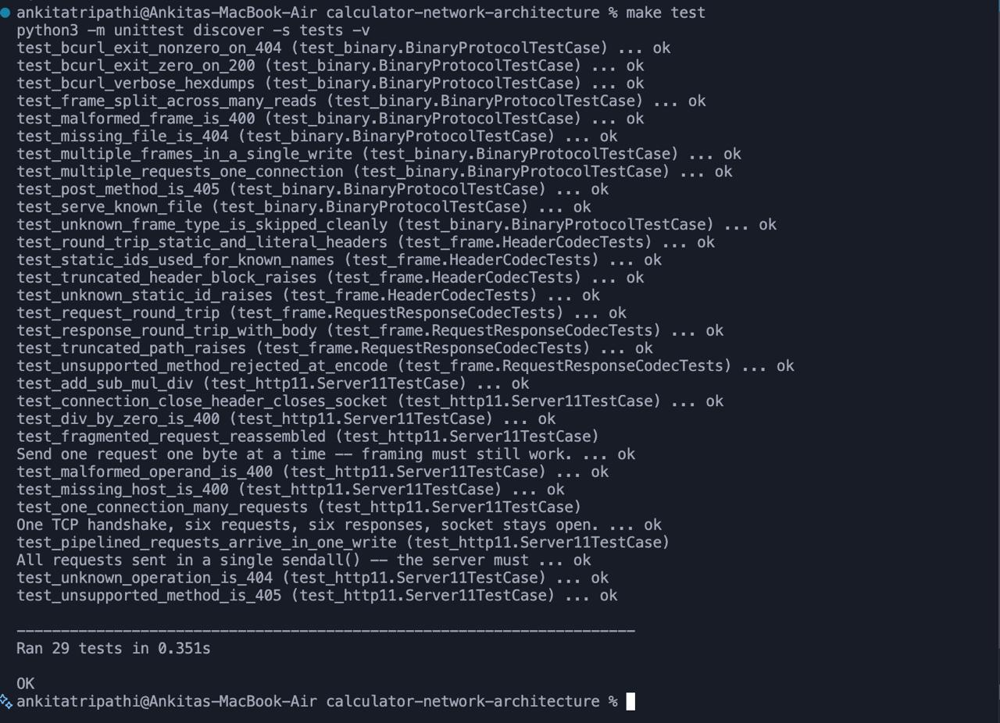
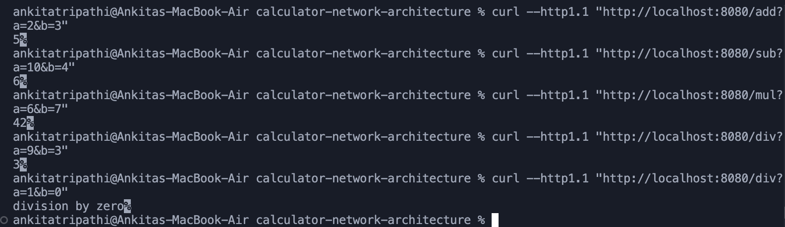
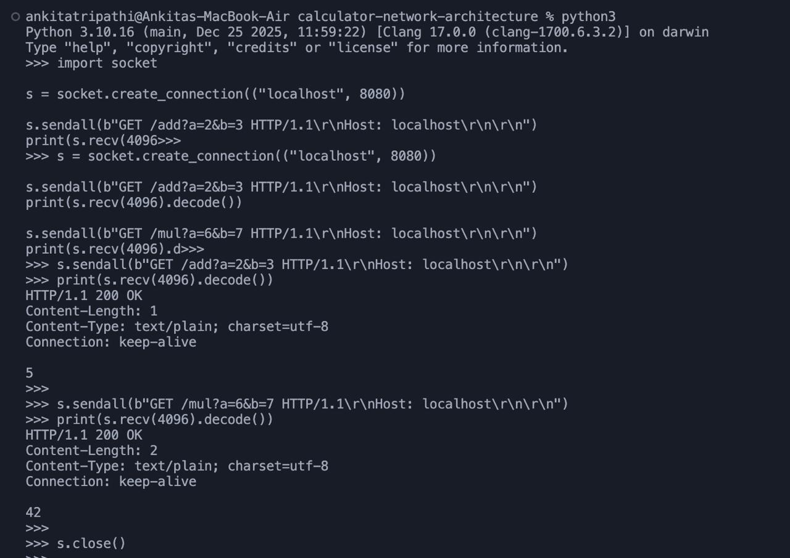
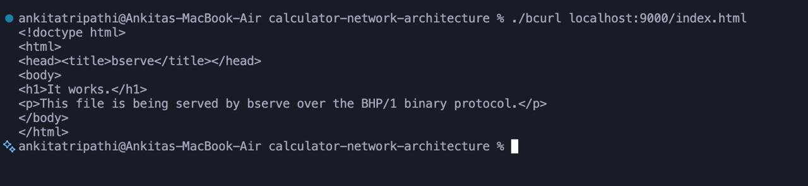
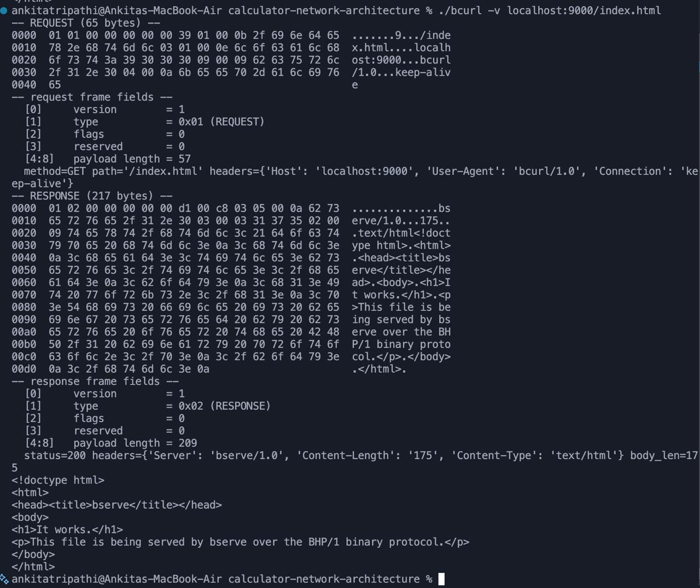

## Proof of Implementation

⋆˚꩜｡ ---------------------------------------------------------------- .✦ ݁˖

### 1. Test Suite

The full automated test suite runs clean, with every test passing.

### 2. HTTP/1.1 Calculator

The HTTP/1.1 server correctly processes calculator requests end to end.

### 3. Persistent HTTP/1.1 Connection

A single TCP connection is shown handling multiple HTTP requests in sequence,
without being reopened between them.

### 4. Binary File Server

The BHP/1 server correctly serves files to a connecting client.

### 5. Binary Frame / Hex Output

Running the client in verbose mode reveals the underlying binary frame
structure and the raw response bytes.

